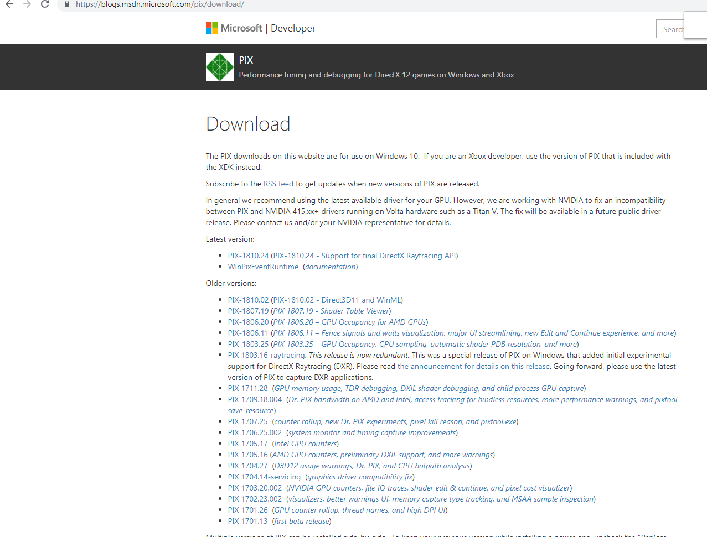
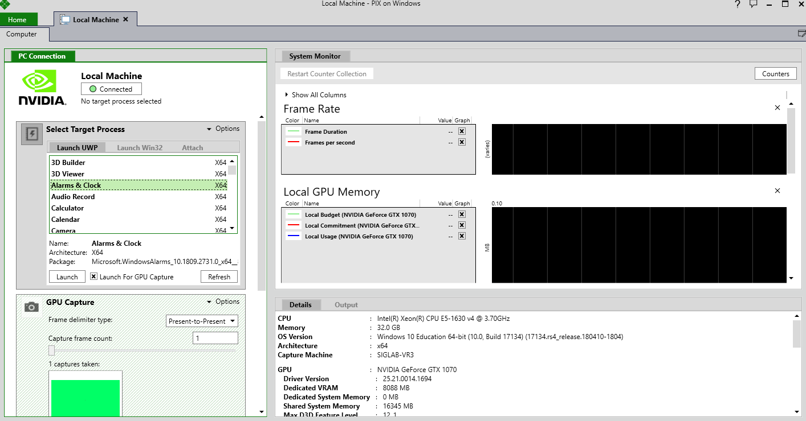

# rtx-explore

# Required Environment
* Visual Studio 2017 version 15.8.4 or higher.
* [Windows 10 October 2018 (17763) SDK](https://developer.microsoft.com/en-US/windows/downloads/windows-10-sdk)
     * Get the ISO
     * Mount
     * Install all options preferably
* Developer mode enabled on Windows 10

# Building & Running
1) Test that you can run all 3 samples
   * Go to /src
   * Choose one of the sample (HelloTriangle, Procedural, SimpleLighting) and Set as StartUp Project
   * Build and run in Debug/Release mode
      * Make sure that the NuGet package manager can automatically retrieve missing packages. This might require running build twice.
2) TBD

# Debugging Fallback layer (possibly actual RTX, not tested, since we are not testing on actual RTX)

### Option 1: Microsoft Pix debugger (Fallback tested, RTX (?), but supported)

[https://blogs.msdn.microsoft.com/pix/download/](https://blogs.msdn.microsoft.com/pix/download/)

Go to the downlaod page and click to download the latest version (in the image below, PIX-1810.24)

Now, once you have it downloaded, run the executable and something like this should show up:

Go to `Launch Win32` tab under Select Target Process

Find the folder that is rtx-explore

In the `Working Directory` line, fill in the line with the rtx-explorer location + `\src\D3D12PathTracer`

`C:\Users\SIG\Desktop\RTX\rtx-explore\src\D3D12PathTracer`

In the `Path to Executable` line, fill in the line with the rtx-explorer location + `\src\D3D12PathTracer\bin\x64\Debug\D3D12PathTracer.exe`

`C:\Users\SIG\Desktop\RTX\rtx-explore\src\D3D12PathTracer\bin\x64\Debug\D3D12PathTracer.exe`

Press Launch, and the application should show up

Now, it's time to mess with Pix!

Press `Print screen` button to capture a frame and `1 captures taken` will appear under `GPU Capture`

Double click the image under `1 captures taken` and a screen will be brought up like below:

Press the `play` button after `Analysis is not running.` at the top right to begin analysis of the frame 

You should get `Analysis is running on NVIDIA ...`, in my case `NVIDIA GeForce GTX 1070`

Now, mess around with pix and take a look at this quick playlist to learn how to debug with PIX 

[Playlist link](https://www.youtube.com/playlist?list=PLeHvwXyqearWuPPxh6T03iwX-McPG5LkB)

### Option 2: Nvidia debugger (RTX only)

[https://developer.nvidia.com/nsight-visual-studio-edition](https://developer.nvidia.com/nsight-visual-studio-edition)

